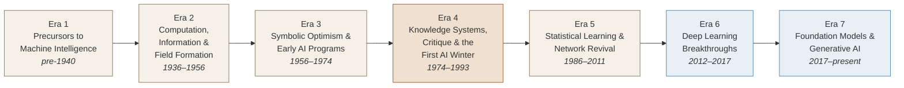

# Sprint 2 — Cleanup, Timeline, and QA

> **Spec:** `docs/_specs/curatorial-enrichment/spec.md`
> **Depends on:** Sprint 1 (pages integration must be complete)
> **Scope:** Remove dead code, fix navigation label, add Mermaid era-flow
> timeline to Reading Maps, and run full QA.

---

## Pre-flight

```bash
# Verify Sprint 1 is complete
npm run build
npm run test
```

---

## Task 1 — Delete unused `home-sequence-chart.tsx`

**File:** `components/content/home/home-sequence-chart.tsx` (DELETE)

Verify no imports reference it:

```bash
grep -r "home-sequence-chart\|HomeSequenceChart\|SequenceChart" app/ components/ lib/ --include="*.ts" --include="*.tsx" | grep -v "home-sequence-chart.tsx"
```

If no references found, delete the file:

```bash
rm components/content/home/home-sequence-chart.tsx
```

**Verify:**

```bash
npm run build
```

---

## Task 2 — Fix "Guides" → "Guide" in navigation

**File:** `lib/site-navigation.ts` (or wherever the nav label is defined)

Find the navigation entry for the Guides section and change the label from
"Guides" to "Guide" since only one guide exists.

**Verify:**

```bash
grep -n "Guides\|guides" lib/site-navigation.ts
npm run build
```

---

## Task 3 — Add Mermaid era-flow timeline to Reading Maps

**File:** `app/reading-maps/intellectual-lineage/page.tsx`

Add a Mermaid-rendered SVG diagram at the top of the page showing the 7-era
timeline as a flow chart:



Use the `renderMermaidDiagram` tool to generate a static SVG, then embed it
as an `` or inline SVG in the page. Store the SVG in
`public/media/generated/era-timeline.svg`.

**Verify:**

```bash
ls public/media/generated/era-timeline.svg
npm run build
```

---

## Task 4 — Full QA audit

### 4a — Scorecard verification

Run the following checks against the spec's scorecard:

```bash
npx tsx -e "
import { peopleProfiles, institutionProfiles, historicalAnchors } from './lib/narrative-data';

// People coverage: eras with >= 1 portrait
const peopleEras = new Set(peopleProfiles.map(p => p.era));
console.log('People eras:', peopleEras.size, '/7', [...peopleEras].sort().join(', '));

// Institution coverage
const instEras = new Set(institutionProfiles.map(p => p.era));
console.log('Institution eras:', instEras.size, '/7', [...instEras].sort().join(', '));

// Historical anchor coverage
const anchorEras = new Set(historicalAnchors.map(a => a.era));
console.log('Anchor eras:', anchorEras.size, '/7', [...anchorEras].sort().join(', '));

// External URLs check
const allProfiles = [...peopleProfiles, ...institutionProfiles];
const externalImages = allProfiles.filter(p => p.imageUrl && !p.imageUrl.startsWith('/'));
console.log('External image URLs:', externalImages.length, externalImages.map(p => p.slug).join(', ') || '(none)');
"
```

### 4b — Build and test

```bash
npm run build
npm run test
```

### 4c — Dead code check

```bash
# Verify home-sequence-chart is gone
ls components/content/home/home-sequence-chart.tsx 2>&1 | grep -c "No such file"

# Verify no dangling imports
grep -r "home-sequence-chart\|HomeSequenceChart" app/ components/ lib/ --include="*.ts" --include="*.tsx"
```

### 4d — Navigation label check

```bash
grep -n '"Guide"' lib/site-navigation.ts
```

### 4e — Timeline asset check

```bash
ls -la public/media/generated/era-timeline.svg
```

---

## Final Verification

```bash
npm run build
npm run test

echo "=== Curatorial Enrichment Complete ==="
echo "Scorecard targets:"
echo "  People eras with portraits: 7/7"
echo "  Anchor eras with objects:   6/7"
echo "  Institution eras:           4/7"
echo "  External image URLs:        0"
echo "  Dead code files:            0"
echo "  Nav label:                  Guide (singular)"
echo "  Reading Maps timeline:      SVG present"
```
