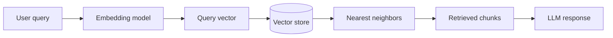

# Embeddings Neighborhood Diagram

### Title

- title: Embeddings neighborhood diagram
- record type: diagram
- current status: approved for implementation

### Content Link

- linked era: Era 7
- linked entities: Vector embeddings; Latent space; Large language models
- intended page or placement: `app/guides/embeddings-latent-space-and-llm-math/page.tsx`

### Why This Asset Exists

- reader benefit: gives a concrete picture of how query, document chunks, and
  nearest neighbors relate inside an embeddings workflow
- teaching role: turns abstract vector similarity into an understandable
  neighborhood model

### Source Or Origin

- source URL or origin: repository-authored explanatory diagram
- creator or source name when known: local repository asset planned from Sprint 9
- evidence basis: `docs/_research/topics/embeddings-latent-space-and-llm-math-bridges.md`

### Attribution And Usage Notes

- attribution requirements when known: none if repository-authored
- usage rationale: diagram is more precise than a generated image for retrieval
  structure
- rights or uncertainty notes: must be labeled as schematic, not as a literal
  model-state visualization

### Draft Mermaid

### Current Implementation State

- current status: produced
- produced artifact: `components/content/visualizations/embeddings-neighborhood-diagram.tsx`
- live placement: `app/guides/embeddings-latent-space-and-llm-math/page.tsx`

### Next Step

- next action: decide whether to keep the live SVG as the primary asset or add a
  separately exported static SVG version for reuse outside the route
- open questions: whether a second narrower diagram should isolate ranking from
  generation more explicitly for novice readers
