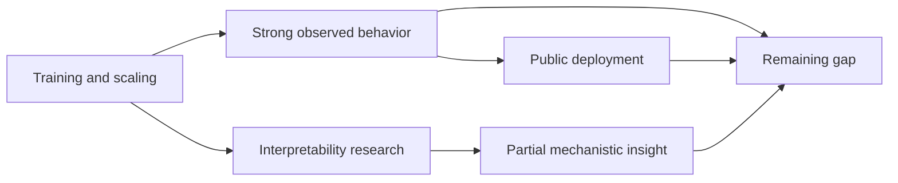

# Interpretability Gap Diagram

### Title

- title: Interpretability gap diagram
- record type: diagram
- current status: approved for implementation

### Content Link

- linked era: Era 7
- linked entities: Mechanistic interpretability; Large language models;
  Instrumental convergence
- intended page or placement: `app/reading-maps/intellectual-lineage/page.tsx`

### Why This Asset Exists

- reader benefit: helps readers distinguish model capability, deployment, and
  mechanistic understanding instead of collapsing them into one claim
- teaching role: makes the phrase "we do not fully understand how LLMs work"
  more specific and less mystical

### Source Or Origin

- source URL or origin: repository-authored explanatory diagram
- creator or source name when known: local repository asset planned from Sprint 9
- evidence basis: `docs/_research/topics/foundation-models-public-ai-and-2026-surface.md`

### Attribution And Usage Notes

- attribution requirements when known: none if repository-authored
- usage rationale: the gap is relational and timeline-based, so a diagram is a
  better fit than another prose block
- rights or uncertainty notes: must not imply a solved mechanistic map of an
  actual deployed model

### Draft Mermaid

### Current Implementation State

- current status: produced
- produced artifact: `components/content/visualizations/interpretability-gap-diagram.tsx`
- live placement: `app/reading-maps/intellectual-lineage/page.tsx`

### Next Step

- next action: decide whether the same diagram should also appear on the Era 7
  live route or remain exclusive to the reading map
- open questions: whether a future version should include responsible-scaling or
  governance as a separate node rather than keeping the current causal chain tighter
